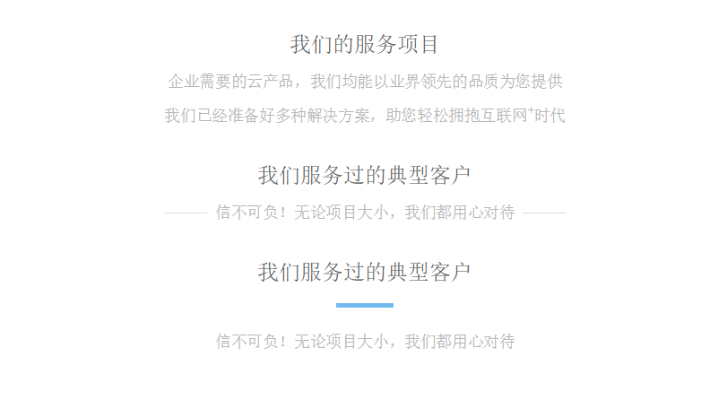

# lidk

区块的标题部分。

## CSS Class

* `.lidk`  主区
* `.lidk-h1`  区块标题。默认为1.5rem
* `.lidk-h2`  区块副标题。默认为1.1rem
* `.lidk-text`  正文。默认为1rem
* `.lidk-line`  一根短横线，默认为3rem宽，1px高。

## 结构

```
.lidk
    .lidk-h1
    .lidk-h2
    .lidk-text
    .lidk-line
```

## 示例

