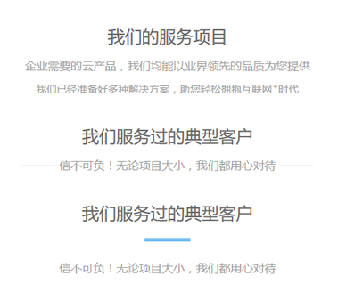

# rxyx

区块的标题部分。

## CSS Class

* `.rxyx`  主区
* `.rxyx-h1`  区块标题。
* `.rxyx-h2`  区块副标题。
* `.rxyx-text`  正文。
* `.rxyx-line`  一根短横线，默认为3rem宽，1px高。

## 结构

```
.rxyx
    .rxyx-h1
    .rxyx-h2
    .rxyx-text
    .rxyx-line
```

## 示例

